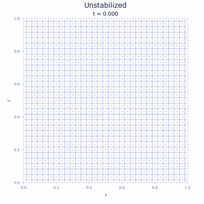
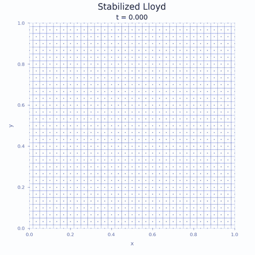

<h1 align="center">
  A Lloyd-stabilized Voronoï particle method
</h1>

<tt>Lean</tt> proofs and animations accompanying the paper
**A Lloyd-stabilized Voronoï particle method** by Bruno Després and Borjan Geshkovski.

<p align="center">
  <a href="vortex-unstabilized.mp4">
    
  </a>
  <a href="vortex-stabilized.mp4">
    
  </a>
</p>

Longer runs to **t = 1.5**, using the same solver settings, are available as
[MP4s and GIF previews](media/extended-t1p5/).

## Visual paper

An interactive companion to the manuscript is served from this repository at
**<https://borjang.github.io/2026-lloyd-transport/>**: the dependency graph of
the results, and for each result a plain-language summary, its exact statement
and proof, what it uses and what uses it, together with the figures and the
movies above.

## Abstract

*We study the stability and consistency of Lloyd's algorithm used in combination with the Lagrangian transport of a density on a Voronoï tessellation. We show that relaxation rates as strong as $O(h^{-1/2})$, where $h$ is the mesh size, give convergence to the continuity equation in Wasserstein distance at the rate $O(h^{1/4})$. Thus the mesh can be kept regular by the correction alone, without the remeshing that Lagrangian methods usually require. An application is proposed for the compressible Euler equations.*

## Lean proofs

The [Lean project](lean/README.md) checks four targeted arguments: periodic-face
identities, removal/insertion estimates, particle dynamics, and mollification
for one-sided Lipschitz velocities. See [the precise statements and assumptions](lean/TARGETS.md).
These are proofs of selected arguments with explicit inputs; they do not constitute
an end-to-end formalization of Theorem 4.1 or the full Section 5 extension.

## Citing

```bibtex
@unpublished{despres2026lloyd,
  title={A Lloyd-stabilized Vorono\"i particle method},
  author={Bruno Despr\'es and Borjan Geshkovski},
  year={2026},
  note={Manuscript}
}
```
