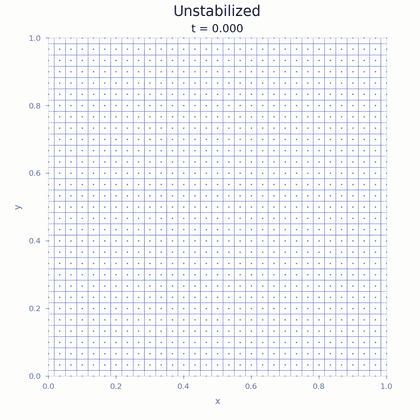
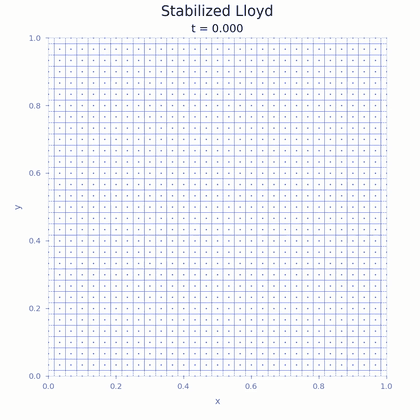

# Vortex runs extended to t = 1.5

The same 31 × 31-generator vortex computation as the original movies, continued
to simulation time **t = 1.5** instead of t = 1. Only the final simulation time
was changed; the solver, physical parameters, mesh, CFL 0.7, and Lloyd
stabilization settings were preserved.

| Without Lloyd stabilization | With Lloyd stabilization |
| --- | --- |
|  |  |

Click a preview for the full-resolution MP4. Both videos are 1080 × 1080,
30 fps, H.264 with `yuv420p` and fast-start metadata. They retain the original
playback speed: 15 seconds for t = 0 to t = 1.5, then a two-second pause on the
final state. GIFs are 420 × 420 at 20 fps. Final-frame PNGs are also included.

The solver records each accepted particle configuration. Display frames
interpolate particle positions between accepted states and reconstruct the
Voronoï mesh; these are visualization frames, not additional solver steps.
The initial and final display frames use exact recorded positions.

For each variant, the accepted times, iteration counts, generator positions,
and Voronoï points before the original final step match the original t = 1
trajectory bitwise. The original run shortened its last step to land exactly
at t = 1; these runs use the ordinary adaptive step through that time,
shortening only the final step at t = 1.5. Thus the original final state is
not imposed as an intermediate checkpoint. [verification.json](verification.json)
records the trajectory checks, final diagnostics, and video-format checks.

The original t = 1 GIF previews remain in the parent directory, the MP4s at
the repository root, and the paper figures in [site/figures](../../site/figures/).
These longer movies are supplementary experiments, not replacements for the
paper's t = 1 figure.
